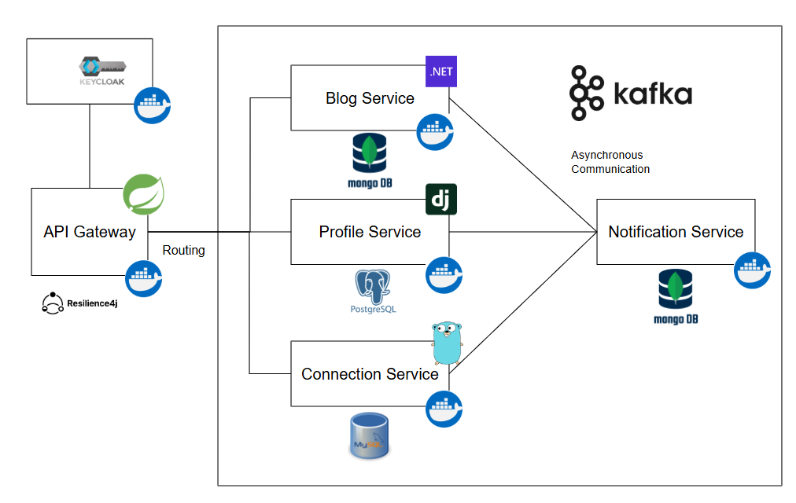

<h3>HHub Project</h3>

---

<h3>Abstract </h3>

Inspired by an idea about a large-scale social networking platform that support vast user base to communicate. Also, it's a chance for me to cultivate my mindset needed to architect and manage high-traffic applications that serve a large number of users. It's why this project was conceived, to help me explore more about scalable architectures, performance optimization, and deployment workflows for real-world social networking systems.

**Note**: This project current state is **practice-first** purpose, it means the latest delivery from main is no more than **staging** environment

<!-- 

 -->
---

  
  <h3>Design Overview</h3>
  

| Service              | Main Tech Stack                   | Description                                                                              |
| -------------------- | --------------------------------- | ---------------------------------------------------------------------------------------- |
| API Gateway          | Java, Spring Boot                 | Single entry point for all request from client, routes and protects these service behind |
| Identity Provider    | Java, Spring Authorization Server | Manages user identities, handles user authentication and authorization                   |
| Profile Service      | Python with Django                | Resource server for user profile features                                                |
| Blog Service         | ASP.NET Core Web API              | Resource server for post features                                                        |
| Connection Service   | Go with Gin                       | Resource server for user connection features                                             |
| Notification Service | Node.js Express                   | Resource server for notification features                                                |

**Identity Provider**:

At first, I've chosen **Keycloak** as a part of my social system as **Single Sign-On (SSO)** server but then for more control with the work flow in the code base I transition to implement one by **Authorization Server of Spring Projects**. For the frontend, I registered a external client that supported authorization mechanism by **Authorization Code Grant** (**PKCE**). And the internal client, for these services (also gateway) was set up as **Authorization Resource Server**. Early on, I just issued **JWT** token format for _access token_ and _refresh token_, so the _gateway_ and _downstream services_ simply fetch from `/.well-know` endpoint to verify _access token_.

Now my `auth-server` now successfully handling **Authorization Code (PKCE)**, **Client Credentials**, and **Password Grant** flows. The next steps involve migrating to **federated authentication** with Google/GitHub/.. accounts, adding some necessary modifications and frontend integration to fully realize OAuth2 features.

**API Gateway**:

Build base on **Spring Cloud Gateway**. It serves as the single entry point for all clients, routing and load-balancing requests to downstream services. On behalf of its protected services to play a role as **OAuth2 Client** before external request to secured resource and be a **Resource Server** to validate the attached access token from request header.

To improve resilience, Resilience4J was added for rate limiting and circuit breaking, ensuring that transient failures or traffic spikes don’t cascade across the system.

**Blog Service**:

Build base on **.NET Core Web API**, its feature relate to how user post a new and provide interested feed page for them. Post and commend records has stored **Mongo DB** by MongoDB Driver. 

Previously, I use one **post** entity for both data persistence (writes) and data retrieval (reads). I'm now separating the model corresponds with these flow into saved post item from write and **feed** item will be propagated for consumption by followers. This paves the way for an upcoming **CQRS** implementation and some database layer modifications to achieve performance optimization practices.

Refactoring the codebase toward a **Hexagonal Architecture** is a lower priority right now.

**Connection Service**:

Is written in **Go** using the **Gin** framework. It manages user relationships—friendships and follows—and persists data in MySQL via the **GORM ORM**. The project follows a standard Go project layout, with a few customizations. The main logic here is around sending/receiving friend requests and following/being followed. Now I has add **Redis** boost performance for fetching follower and following data. Kafka integration for real-time notifications on new requests will be added after some UI updates.

**Profile Service**:

Implemented using **Django REST Framework** and managed with **Poetry**, the Profile Service stores user profiles in **PostgreSQL**. Its modular project structure makes it easy to extend and maintain. Currently, I rely on Django’s built-in ORM for migration schema.

**Notification Service**:

Build base on **NodeJS Express**, consume **Kafka** notification topic and store message to **Mongo DB**, support for user to get their notification. Exposing endpoints for users to retrieve their notifications is the first approach I chosen. I'll soon add push-notification support and more advanced delivery guarantees.

**HH Community UI**

The UI is developed in **ReactJS**, incorporating key libraries: **MUI** for component styling, **Styled Components** for custom theming, **Axios** for HTTP requests, **Redux** for state management, and **React Router DOM** for client-side navigation. Perhaps I can cover fullstack, but I recognize that the UI side isn’t my absolute strongest suit. This UI project still have more improvement in the coming updates.

<h3>Summary</h3>

- All core features are now fully implemented and in correct state. All my next step will be on improving some function and polishing the codebase.
- Due to practice focus, I bypassed several steps. This was a valuable experience, clearly showcasing the risks of missing pre-commit checks, which led to key leaks and unlinted code. And with very low test coverage made it easy crash some function on runtime.

<h3>Upcoming work</h3>

- [ ] Looks like it will take me a little longer before the first delivery to **EKS**.

- [ ] Add **federated authentication** and complete Oauth2 implement 

- [ ] Of course, **enhanced test coverage**.

- [ ] Get everything integrated **from front to back** for these new features.

- [ ] A **big refactor** with several modify of **database layer** for performance practices.

- [ ] Security aspect with **security testing** also needs to be considered.
